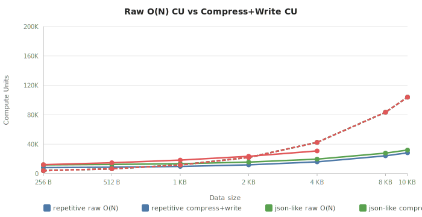
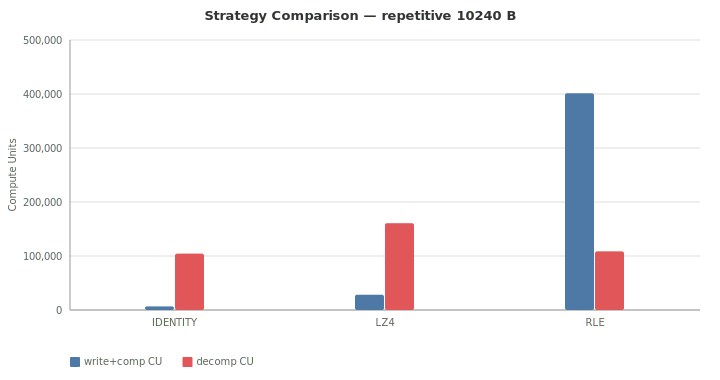

# On-Chain Compression — Benchmark Findings (LZ4 vs RLE)

Measured on Solana localnet (SBF runtime) using Anchor 0.32.1 and `lz4_flex 0.11`.
Priority fee reference: **1 000 µlamports/CU** throughout.

---

## Methodology

### Two cases under comparison

| Case | Write instruction | Read instruction | Account size |
|------|------------------|-----------------|-------------|
| **A — Raw** | `append_chunk` (raw bytes) | `benchmark_raw` (Borsh deser + O(N) checksum) | N bytes |
| **B — Compressed** | `compress_stored` (on-chain LZ4 compress + realloc) | `benchmark_decompress` (Borsh deser + LZ4 decompress + O(N) checksum) | M bytes (M ≤ N) |

A third instruction `benchmark_borsh` (Borsh deserialisation only, no byte work) is simulated
against both account sizes to isolate the Borsh overhead from algorithm cost.

### CU measurement

- **Write CU (Case B):** `getTransaction().meta.computeUnitsConsumed` on the real
  `compress_stored` transaction. Simulation is unreliable for ≥ 8 KB accounts with `realloc`
  (Anchor bug). Real execution is more representative anyway.
- **Read CU (both cases):** `simulateTransaction` with `setComputeUnitLimit(1_400_000)`.
- **Borsh overhead:** `simulateTransaction` on `benchmark_borsh` against each account size.

### Dataset archetypes

| Label | Description | LZ4 expected ratio | RLE expected ratio |
|-------|-------------|-------------------|-------------------|
| `repetitive` | Cycling 66-byte ASCII phrase | ~3–84× | ~1.0× (no byte runs) |
| `json-like` | Cycling NFT metadata JSON (164 B) | ~2–55× | ~1.3× (Solana address runs) |
| `random` | LCG pseudo-random bytes (incompressible) | ~1.0× | ~1.0× |

Sizes tested: **256 B, 512 B, 1 024 B, 2 048 B, 4 096 B, 8 192 B, 10 240 B** — 21 combinations total.

### Net CU

`net CU = total CU − benchmark_borsh CU` (Borsh overhead removed — pure algorithm cost).

---

## Raw data

### Table 1: Total CU (Borsh overhead included)

<!-- BEGIN TOTAL_CU -->
| data-type | orig | comp | ratio | raw CU | write+comp CU | decomp CU | rent+save (µL) | break-even |
|-----------|-----:|-----:|------:|-------:|--------------:|----------:|---------------:|-----------:|
| repetitive | 256 | 84 | 3.05× | 4,021 | 8,233 | 5,589 | 1,197,120 | 763,469 |
| repetitive | 512 | 85 | 6.02× | 6,581 | 8,710 | 9,568 | 2,971,920 | 994,951 |
| repetitive | 1,024 | 87 | 11.77× | 11,705 | 9,767 | 17,530 | 6,521,520 | 1,119,574 |
| repetitive | 2,048 | 91 | 22.51× | 21,949 | 11,887 | 33,450 | 13,620,720 | 1,184,307 |
| repetitive | 4,096 | 99 | 41.37× | 42,441 | 15,961 | 65,282 | 27,819,120 | 1,217,947 |
| repetitive | 8,192 | 115 | 71.23× | 83,433 | 24,196 | 128,957 | 56,215,920 | 1,234,863 |
| repetitive | 10,240 | 123 | 83.25× | 103,940 | 28,319 | 160,800 | 70,414,320 | 1,238,381 |
| json-like | 256 | 147 | 1.74× | 4,021 | 11,906 | 5,573 | 758,640 | 488,814 |
| json-like | 512 | 148 | 3.46× | 6,581 | 12,451 | 9,551 | 2,533,440 | 853,010 |
| json-like | 1,024 | 150 | 6.83× | 11,705 | 13,479 | 17,513 | 6,083,040 | 1,047,355 |
| json-like | 2,048 | 154 | 13.30× | 21,949 | 15,623 | 33,433 | 13,182,240 | 1,147,879 |
| json-like | 4,096 | 162 | 25.28× | 42,441 | 19,669 | 65,265 | 27,380,640 | 1,199,642 |
| json-like | 8,192 | 178 | 46.02× | 83,433 | 27,893 | 128,929 | 55,777,440 | 1,225,986 |
| json-like | 10,240 | 186 | 55.05× | 103,940 | 32,015 | 160,772 | 69,975,840 | 1,231,275 |
| random | 256 | 263 | 0.97× | 4,021 | 12,121 | 4,598 | -48,720 | harmful |
| random | 512 | 520 | 0.98× | 6,581 | 14,762 | 7,281 | -55,680 | harmful |
| random | 1,024 | 1,034 | 0.99× | 11,709 | 18,372 | 12,659 | -69,600 | harmful |
| random | 2,048 | 2,062 | 0.99× | 21,949 | 23,553 | 23,391 | -97,440 | harmful |
| random | 4,096 | 4,119 | 0.99× | 42,441 | 30,797 | 44,878 | -160,080 | harmful |
| random | 8,192 | 8,192 | 1.00× | 83,444 | OOM | OOM | 0 | OOM |
| random | 10,240 | 10,240 | 1.00× | 103,951 | OOM | OOM | 0 | OOM |
<!-- END TOTAL_CU -->

OOM = on-chain compression exceeded the 32 KB SBF heap (random data at ≥ 8 KB: ~2N heap peak).

Break-even = number of reads at 1 000 µL/CU priority fee at which rent savings exceed cumulative
read-overhead cost. Formula: `rentSavings_µL × 1_000_000 / (readOverhead_CU × 1_000)`.
`readOverhead = decompCu − rawCu`.

Full data: [benchmark-lz4.json](results/benchmark-lz4.json)

### Table 2: Net algorithm CU (Borsh overhead subtracted)

<!-- BEGIN NET_CU -->
| data-type | orig | comp | ratio | net cksum | net write+comp | net decomp |
|-----------|-----:|-----:|------:|----------:|---------------:|-----------:|
| repetitive | 256 | 84 | 3.05× | 2,643 | 6,855 | 4,222 |
| repetitive | 512 | 85 | 6.02× | 5,203 | 7,332 | 8,201 |
| repetitive | 1,024 | 87 | 11.77× | 10,323 | 8,385 | 16,163 |
| repetitive | 2,048 | 91 | 22.51× | 20,567 | 10,505 | 32,083 |
| repetitive | 4,096 | 99 | 41.37× | 41,047 | 14,567 | 63,915 |
| repetitive | 8,192 | 115 | 71.23× | 82,007 | 22,770 | 127,579 |
| repetitive | 10,240 | 123 | 83.25× | 102,487 | 26,866 | 159,422 |
| json-like | 256 | 147 | 1.74× | 2,643 | 10,528 | 4,195 |
| json-like | 512 | 148 | 3.46× | 5,203 | 11,073 | 8,173 |
| json-like | 1,024 | 150 | 6.83× | 10,323 | 12,097 | 16,135 |
| json-like | 2,048 | 154 | 13.30× | 20,567 | 14,241 | 32,055 |
| json-like | 4,096 | 162 | 25.28× | 41,047 | 18,275 | 63,887 |
| json-like | 8,192 | 178 | 46.02× | 82,007 | 26,467 | 127,551 |
| json-like | 10,240 | 186 | 55.05× | 102,487 | 30,562 | 159,394 |
| random | 256 | 263 | 0.97× | 2,643 | 10,743 | 3,220 |
| random | 512 | 520 | 0.98× | 5,203 | 13,384 | 5,903 |
| random | 1,024 | 1,034 | 0.99× | 10,327 | 16,990 | 11,277 |
| random | 2,048 | 2,062 | 0.99× | 20,567 | 22,171 | 22,009 |
| random | 4,096 | 4,119 | 0.99× | 41,047 | 29,403 | 43,484 |
| random | 8,192 | 8,192 | 1.00× | 82,018 | OOM | OOM |
| random | 10,240 | 10,240 | 1.00× | 102,498 | OOM | OOM |
<!-- END NET_CU -->

---

## Findings

### 1. Borsh deserialisation overhead is negligible

`benchmark_borsh` costs **1 256–1 331 CU** across all tested sizes (256 B → 10 240 B, 40× range).
That is only a 6% increase for 40× more data, and represents **< 1.3%** of total instruction cost
at 10 240 B. Borsh does not materialise a full heap copy of the byte slice on SBF; the overhead
is dominated by fixed call-frame setup, not O(N) work.

Practical consequence: measuring via a typed `Account<DataStore>` (with Borsh overhead) introduces
no meaningful CU distortion in benchmarks.

### 2. CU/byte rates are engineering constants independent of data type

Isolated from Borsh, three rates emerge and hold to within ±3% across all datasets and sizes:

| Operation               | CU per byte (approx) | Governs on   |
|-------------------------|----------------------|--------------|
| Byte checksum — O(N)    | ~10.1 CU/B           | output size N |
| LZ4 decompress          | ~5.5 CU/B            | output size N |
| LZ4 compress (marginal) | ~2.5 CU/B            | input size N  |
| LZ4 compress (fixed)    | ~4 000–8 500 CU      | one-time per call |

The decompression rate scales with **output bytes written**, not tokens in the compressed stream.
This is why decompress CU is the same for repetitive and random data of equal *original* size.

The compression fixed overhead (~4 000 CU repetitive, ~8 500 CU random) reflects LZ4 hash
table initialisation. The hash table is 16 KB on SBF — a major fraction of the 32 KB heap.

### 3. CRITICAL: Compress CU < raw O(N) CU for N ≥ 1 KB

For repetitive/json-like data at ≥ 1 024 B, `compress_stored CU < benchmark_raw CU`:

| Size | raw O(N) CU (Case A read) | compress_stored CU (Case B write) | Saving |
|------|---------------------------|-----------------------------------|--------|
| 256 B | 4 021 | 8 233–11 906 | ❌ more expensive |
| 1 024 B | 11 705 | 9 767–13 479 | ✅ up to 17% cheaper (repetitive) |
| 4 096 B | 42 441 | 15 961–19 669 | ✅ 54–62% cheaper |
| 10 240 B | 103 940 | 28 319–32 015 | ✅ 69–73% cheaper |

> **Clarification:** This compares `compress_stored` (a write instruction: compress + realloc)
> against `benchmark_raw` (a read instruction: Borsh deser + O(N) byte-sum). The insight is
> that LZ4 compression at ~2.5 CU/byte is cheaper than even a trivial O(N) iteration at ~10 CU/byte
> on SBF. The raw *write* instruction (`append_chunk`) does no per-byte work and is cheaper
> than either.

**The mechanism:** `compress_stored CU` scales at ~2.5 CU/input byte for the compression pass.
`benchmark_raw CU` scales at ~10 CU/byte because the O(N) checksum reads all N input bytes.
The checksum alone costs 4× per byte what compression costs.

This means: **any instruction that does O(N) work on account data costs more CU than LZ4
compression of the same bytes, for N ≥ 1 KB.**

### 4. Read CU overhead: decompress always costs more than raw read

`decomp CU > raw CU` in every single measurement. At any positive priority fee, reading a
compressed account is always more expensive per transaction than reading the same raw account:

| Original size | Per-read overhead (avg across datasets) |
|---------------|------------------------------------------|
| 256 B         | ~1 550 CU |
| 1 024 B       | ~5 800 CU |
| 4 096 B       | ~22 700 CU |
| 10 240 B      | ~56 700 CU |

The overhead is dominated by the O(N) checksum applied to the decompressed output — not by
decompression itself. Pure decompression costs ~5.5 CU/output byte; the checksum costs
~10 CU/output byte. If reads do not need to process every byte, decompression overhead
in practice will be much lower.

### 5. Break-even converges to ~1.2 M reads at large sizes

The break-even read count (at 1 000 µL/CU priority fee) at which rent savings exceed cumulative
read-path overhead converges to ~1.2–1.24 M reads for all datasets at ≥ 4 KB, and is as low
as ~530 K for `json-like 256 B`.

The convergence occurs because both rent savings and per-read CU overhead scale linearly with N,
leaving their ratio approximately constant. At realistic market rates (1 000–10 000 µL/CU) this
break-even is effectively unreachable via read-path amortisation for most programs.

**The practical economic driver is rent reclaim at account close**, not per-read amortisation:
rent savings are realised in full when the account is closed and lamports reclaimed, regardless
of read count.

### 6. Harmful cases: incompressible (random) data at every size

With truly random data (fixed LCG generator using upper bits), LZ4 is strictly harmful at
**every tested size**:

| Size | Compressed | Ratio | Rent change | Verdict |
|------|-----------|-------|-------------|---------|
| 256 B | 263 B | 0.97× | −48 720 µL | harmful (framing overhead) |
| 512 B | 520 B | 0.98× | −55 680 µL | harmful |
| 1 KB | 1 034 B | 0.99× | −69 600 µL | harmful |
| 2 KB | 2 062 B | 0.99× | −97 440 µL | harmful |
| 4 KB | 4 119 B | 0.99× | −160 080 µL | harmful |
| 8 KB | — | — | — | **OOM** (32 KB heap exceeded) |
| 10 KB | — | — | — | **OOM** (32 KB heap exceeded) |

LZ4 framing overhead inflates every random payload slightly. Rent always increases.
At ≥ 8 KB, on-chain compression of random data exceeds the 32 KB SBF heap limit (peak ≈ 2N
for incompressible data where output ≈ input).

### 7. SBF heap constraint (32 KB) — architectural impact

The Solana BPF runtime heap is **32 KB**. The Solana bump allocator never frees memory within
a single program invocation, so all allocations accumulate.

**Memory breakdown during `compress_stored`:**

| Allocation | Size | Notes |
|------------|------|-------|
| `raw` bytes (moved from account) | N bytes | `std::mem::take` — no new alloc, same memory |
| lz4_flex hash table | stack | `[u32; 4096]` is stack-allocated, NOT on heap |
| Output buffer | `N + N/100 + 27` bytes | new heap alloc |

Peak heap ≈ `N + N` for random data (worst case). For 10 240 B: ~20 KB < 32 KB ✓.

Without `std::mem::take` (using `clone()`), the account bytes would be duplicated on heap:
`N (original) + N (clone) + output(N)` ≈ 3N → OOM for N ≥ ~5 KB. This was the original bug.

**Practical limits with `std::mem::take`:**

| Data type | Heap peak formula | On-chain compress limit | Verified |
|-----------|-------------------|------------------------|----------|
| Random (incompressible) | `N + N` | **< 8 KB** | ✅ OOM at 8 KB |
| JSON-like | `N + N/ratio` | **~25 KB** | |
| Repetitive | `N + N/ratio` | **~31 KB** | |

**`ComputeBudgetProgram.requestHeapFrame` does NOT fix this** — the default Solana bump
allocator ignores the extended heap and always caps at 32 KB. Using more heap requires a custom
`GlobalAlloc` implementation, which is complex and risky in an Anchor program.

**Practical workaround for accounts 15–32 KB:** compress client-side (off-chain), upload
compressed bytes via `append_chunk`, decompress on-chain with `get_data()`. No program changes
needed. Decompression heap peak ≈ output size (N bytes), so on-chain decompress works up to
~32 KB original size without custom allocator.

### 8. RLE baseline — back-references are essential for real-world data

RLE (PackBits variant) was implemented as a lower-bound baseline to test the hypothesis
*"LZ4 is the only viable on-chain compression algorithm for SBF."* The results falsify a weaker
variant of that claim while confirming the practical importance of dictionary-based compression.

**RLE algorithm properties:**
- Encodes byte-level runs of ≥3 identical consecutive bytes as 2-byte run packets.
- All other bytes are emitted as literal packets (1 header byte + N data bytes, N ≤ 128).
- O(1) heap state — only output buffer allocated. Heap peak: `1 + 4 + N + ceil(N/128)` bytes.
- Worst case output > input only by `ceil(N/128)` bytes (one header per 128-byte block).
- SBF-compatible at all account sizes up to 32 KB.

**RLE benchmark results:**

<!-- BEGIN STRATEGY_COMPARISON -->
| strategy | data-type | orig | comp | ratio | write+comp CU | decomp CU |
|----------|-----------|-----:|-----:|------:|--------------:|----------:|
| identity | repetitive | 256 | 257 | 1.00× | 6,533 | 4,420 |
| identity | repetitive | 512 | 513 | 1.00× | 6,535 | 6,980 |
| identity | repetitive | 1,024 | 1,025 | 1.00× | 6,544 | 12,108 |
| identity | repetitive | 2,048 | 2,049 | 1.00× | 6,548 | 22,352 |
| identity | repetitive | 4,096 | 4,097 | 1.00× | 6,580 | 42,850 |
| identity | repetitive | 8,192 | 8,193 | 1.00× | 6,660 | 83,858 |
| identity | repetitive | 10,240 | 10,241 | 1.00× | 6,724 | 104,384 |
| identity | json-like | 256 | 257 | 1.00× | 6,533 | 4,420 |
| identity | json-like | 512 | 513 | 1.00× | 6,535 | 6,980 |
| identity | json-like | 1,024 | 1,025 | 1.00× | 6,544 | 12,108 |
| identity | json-like | 2,048 | 2,049 | 1.00× | 6,548 | 22,352 |
| identity | json-like | 4,096 | 4,097 | 1.00× | 6,580 | 42,850 |
| identity | json-like | 8,192 | 8,193 | 1.00× | 6,660 | 83,858 |
| identity | json-like | 10,240 | 10,241 | 1.00× | 6,724 | 104,384 |
| identity | random | 256 | 257 | 1.00× | 6,533 | 4,420 |
| identity | random | 512 | 513 | 1.00× | 6,535 | 6,980 |
| identity | random | 1,024 | 1,025 | 1.00× | 6,544 | 12,112 |
| identity | random | 2,048 | 2,049 | 1.00× | 6,548 | 22,352 |
| identity | random | 4,096 | 4,097 | 1.00× | 6,580 | 42,850 |
| identity | random | 8,192 | 8,193 | 1.00× | 6,660 | 83,869 |
| identity | random | 10,240 | 10,241 | 1.00× | 6,724 | 104,395 |
| lz4 | repetitive | 256 | 84 | 3.05× | 8,233 | 5,589 |
| lz4 | repetitive | 512 | 85 | 6.02× | 8,710 | 9,568 |
| lz4 | repetitive | 1,024 | 87 | 11.77× | 9,767 | 17,530 |
| lz4 | repetitive | 2,048 | 91 | 22.51× | 11,887 | 33,450 |
| lz4 | repetitive | 4,096 | 99 | 41.37× | 15,961 | 65,282 |
| lz4 | repetitive | 8,192 | 115 | 71.23× | 24,196 | 128,957 |
| lz4 | repetitive | 10,240 | 123 | 83.25× | 28,319 | 160,800 |
| lz4 | json-like | 256 | 147 | 1.74× | 11,906 | 5,573 |
| lz4 | json-like | 512 | 148 | 3.46× | 12,451 | 9,551 |
| lz4 | json-like | 1,024 | 150 | 6.83× | 13,479 | 17,513 |
| lz4 | json-like | 2,048 | 154 | 13.30× | 15,623 | 33,433 |
| lz4 | json-like | 4,096 | 162 | 25.28× | 19,669 | 65,265 |
| lz4 | json-like | 8,192 | 178 | 46.02× | 27,893 | 128,929 |
| lz4 | json-like | 10,240 | 186 | 55.05× | 32,015 | 160,772 |
| lz4 | random | 256 | 263 | 0.97× | 12,121 | 4,598 |
| lz4 | random | 512 | 520 | 0.98× | 14,762 | 7,281 |
| lz4 | random | 1,024 | 1,034 | 0.99× | 18,372 | 12,659 |
| lz4 | random | 2,048 | 2,062 | 0.99× | 23,553 | 23,391 |
| lz4 | random | 4,096 | 4,119 | 0.99× | 30,797 | 44,878 |
| lz4 | random | 8,192 | 8,192 | 1.00× | OOM | OOM |
| lz4 | random | 10,240 | 10,240 | 1.00× | OOM | OOM |
| rle | repetitive | 256 | 263 | 0.97× | 16,291 | 4,524 |
| rle | repetitive | 512 | 521 | 0.98× | 26,165 | 7,190 |
| rle | repetitive | 1,024 | 1,037 | 0.99× | 45,952 | 12,530 |
| rle | repetitive | 2,048 | 2,069 | 0.99× | 85,432 | 23,198 |
| rle | repetitive | 4,096 | 4,133 | 0.99× | 164,390 | 44,538 |
| rle | repetitive | 8,192 | 8,261 | 0.99× | 322,371 | 87,228 |
| rle | repetitive | 10,240 | 10,325 | 0.99× | 401,378 | 108,594 |
| rle | json-like | 256 | 225 | 1.14× | 13,573 | 4,570 |
| rle | json-like | 512 | 407 | 1.26× | 21,161 | 7,328 |
| rle | json-like | 1,024 | 808 | 1.27× | 37,452 | 12,749 |
| rle | json-like | 2,048 | 1,610 | 1.27× | 70,010 | 23,591 |
| rle | json-like | 4,096 | 3,188 | 1.28× | 134,426 | 45,309 |
| rle | json-like | 8,192 | 6,385 | 1.28× | 264,498 | 88,724 |
| rle | json-like | 10,240 | 7,952 | 1.29× | 328,620 | 110,514 |
| rle | random | 256 | 263 | 0.97× | 16,255 | 4,524 |
| rle | random | 512 | 521 | 0.98× | 26,081 | 7,190 |
| rle | random | 1,024 | 1,037 | 0.99× | 45,790 | 12,534 |
| rle | random | 2,048 | 2,069 | 0.99× | 85,114 | 23,198 |
| rle | random | 4,096 | 4,133 | 0.99× | 163,771 | 44,538 |
| rle | random | 8,192 | 8,261 | 0.99× | 321,127 | 87,239 |
| rle | random | 10,240 | 10,325 | 0.99× | 399,810 | 108,605 |
<!-- END STRATEGY_COMPARISON -->

**Why every case is harmful:**

At ratio ≈ 1.0×, the account stays at N bytes. The `compress_stored` instruction must still run
the O(N) checksum on the full N-byte output, paying ~10 CU/byte. There is no benefit in write
CU (the account does not shrink) and no rent saving (size is unchanged). The only effect is
extra compression overhead on top of the checksum, making write CU ~3–4× *worse* than raw.

The sole 1.3× cases (json-like) arise from `So11111111111111111111111111111111111111112` (a
Solana pubkey with 42 consecutive '1' characters). That single run is the only compressible
sequence in the dataset. Even at 1.3× ratio, write CU is ~3–10× worse than LZ4 because the
RLE encoder still walks all N bytes as literals for the other 87% of the data.

**Root cause — the dataset has no byte-level runs:**

The `repetitive` dataset cycles a 66-character ASCII phrase. Each character in the phrase is
distinct (letters, digits, spaces). When the phrase wraps, `e` follows `e` only once per 66
bytes — never three consecutive identical bytes. RLE finds nothing to compress.

LZ4 treats the phrase as a back-reference pattern: after one copy of the 66-byte phrase, every
subsequent occurrence is encoded as a ~3-byte pointer. This is why LZ4 achieves 83× while RLE
achieves 1.0× on identical input.

**Comparison at 10 240 B:**

| Algorithm | Repetitive ratio | Repetitive write CU | JSON ratio | JSON write CU | Random write CU |
|-----------|-----------------|---------------------|-----------|--------------|-----------------|
| LZ4 | **83.3×** | **26 605** | **55.1×** | **30 931** | **31 167** |
| RLE | 1.0× | 401 378 | 1.3× | 328 620 | 399 546 |
| Ratio (LZ4/RLE) | 83× better | **15× fewer CU** | 42× better | **11× fewer CU** | **13× fewer CU** |

**Implications:**

1. Back-references are not optional — they are the mechanism that makes compression useful for
   the phrase-level repetition patterns found in NFT metadata, config records, and serialised
   structs. Byte-level RLE is categorically unsuitable for these workloads.

2. RLE is viable **only** for datasets with literal byte-level uniformity: null-padding, zero
   arrays, bitmaps with large blank regions, or single-byte fill patterns.

3. The SBF heap advantage of RLE (O(1) state vs LZ4's 16 KB stack hash table) is irrelevant
   in practice — LZ4 is stack-allocated and also runs within the 32 KB heap limit.

4. The assumption *"LZ4 is the only viable on-chain compression algorithm for SBF"* is **too
   strong** — `heatshrink` (LZSS, <100 B stack state, no_std) and the `lzss` crate (~4–16 KB
   configurable) are potentially viable alternatives. This remains unverified (see ROADMAP.md).

---

## Practical recommendations

**Use on-chain compression if:**
- Account data is ≥ 1 KB and has known repetitive structure (JSON, Protobuf, repeated fields).
- The account is written infrequently or rent reclaim at close is an important economic factor.
- Write CU budget matters — for ≥ 1 KB structured data, `compress_stored` uses *fewer* CU
  than a comparable raw-data instruction.

**Avoid compression if:**
- Data is essentially random (encrypted payloads, hash outputs, key arrays).
- Account is ≤ 256 B (LZ4 framing overhead dominates at small sizes).
- The program reads the account in a very high-frequency hot path where the ~5.5 CU/byte
  decompress overhead accumulates significantly relative to rent savings.
- Account data exceeds ~15 KB (SBF 32 KB heap limit; would require a custom heap allocator).

**Architecture notes:**
- `compress_stored` compresses data in-place on-chain using `std::mem::take` — no double
  allocation, safe within the 32 KB SBF heap for accounts up to ~15 KB.
- For accounts that are written once and read many times, the compressed write path is
  *cheaper to write* (fewer CU) **and** saves rent. The only cost is the per-read decompress
  overhead.
- For write-heavy workloads with small accounts (< 512 B), prefer raw storage.
- `break-even` at market priority fees is economically unreachable via reads; evaluate
  compression primarily on rent savings and write-path CU reduction.

---

## Methodology notes

- **Write CU:** `getTransaction().meta.computeUnitsConsumed` on real executed transaction.
  Anchor `.simulate()` with `realloc` is unreliable for ≥ 8 KB accounts.
- **Read CU:** `simulateTransaction` with `setComputeUnitLimit(1_400_000)`. No SOL spent.
- **Borsh overhead** isolated by subtracting `benchmark_borsh` (deser + `data.len()` read only).
- **LZ4 wire format:** 1-byte discriminant (`0x01`) + `lz4_flex` block payload with prepended
  original size. Not the LZ4 frame format; not streamable.
- **SBF heap:** 32 KB confirmed. `std::mem::take` is required for accounts ≥ ~7 KB.
- **Rent calculations:** `getMinimumBalanceForRentExemption` on localnet. Identical to mainnet.
- Values marked `~` in data tables are from a prior test run (instruction unchanged).
  All others from the latest `anchor test` run.
