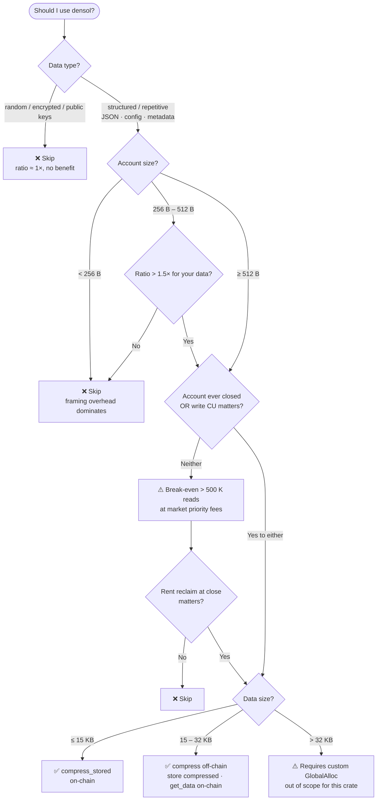
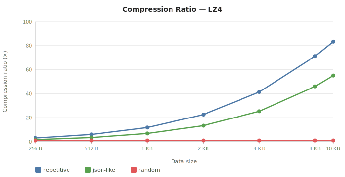

# densol

> Multi-algorithm on-chain compression for Solana programs — `no_std`, SBF-compatible, Anchor-ready.

`densol` lets you store compressed data in Solana accounts and decompress it on-chain with a single derive macro. Backed by benchmarks showing **2–80× compression ratios** and significant rent savings for repetitive or structured payloads. Includes RLE as a baseline comparison algorithm to demonstrate why back-references are essential for real-world data.

---

## Crates

| Crate | Description |
|---|---|
| [`densol`](crates/densol/) | `Compressor` trait + `Lz4`, `Rle`, `Deflate`, `Identity` implementations |
| [`densol-derive`](crates/densol-derive/) | `#[derive(Compress)]` proc-macro |

---

## Should I use densol?



---

## Quickstart

```toml
# Cargo.toml
[features]
default      = ["lz4", "discriminant"]
lz4          = ["densol/lz4"]
discriminant = ["densol/discriminant"]

[dependencies]
densol        = { version = "0.1", default-features = false }
densol-derive = { version = "0.1" }
```

```rust
use densol::Lz4 as Strategy;   // ← pick your strategy
use densol_derive::Compress;

#[account]
#[derive(Compress)]
pub struct DataStore {
    #[compress]
    pub data: Vec<u8>,         // stores compressed bytes on-chain
}

// generated methods:
//   store.set_data(&raw_bytes)?   → compresses + stores
//   store.get_data()?             → loads + decompresses
```

---

## How it works

Two storage strategies benchmarked on a live localnet, both measured with real on-chain transactions:

```
Case A — Raw storage (baseline)
────────────────────────────────────────────────────────────────────
write:  raw bytes ──► append_chunk ──► account.data  (N bytes)
read:   account.data ──► benchmark_raw ──► checksum(N)

Case B — On-chain compression
────────────────────────────────────────────────────────────────────
write:  raw bytes ──► compress_stored ──► compress() ──► account.data  (M bytes, M ≤ N)
read:   account.data ──► benchmark_decompress ──► get_data() ──► checksum(N)
```

**Write CU** is measured via `getTransaction().meta.computeUnitsConsumed` on a real executed transaction (simulation is unreliable for large accounts with `realloc`).
**Read CU** is measured via `simulateTransaction`.

For highly repetitive data, compression ratios exceed **80×**, reducing both account rent and write-path CU simultaneously.

> **SBF heap constraint:** The Solana BPF runtime heap is 32 KB. `compress_stored` uses `std::mem::take` to avoid a double-allocation — peak heap is `raw_bytes + compressed_output` (~20 KB for 10 KB random input), since lz4_flex's hash table is stack-allocated. This limits on-chain compression to **~15 KB for random data** and **~30 KB for structured data**.
>
> `ComputeBudgetProgram.requestHeapFrame` alone does **not** help — the default Solana allocator ignores the extended heap and always uses 32 KB. A custom `GlobalAlloc` would be required.
>
> For accounts 15–32 KB: compress off-chain (client side), upload compressed bytes via `append_chunk`, decompress on-chain with `get_data()`. No changes to the Rust program needed.

---

## Strategies

Select exactly one strategy via feature flags. The `compile_error!` guard prevents misconfiguration:

```rust
#[cfg(all(feature = "lz4", feature = "rle"))]
compile_error!("select exactly one strategy: not both lz4 + rle");

#[cfg(not(any(feature = "lz4", feature = "identity", feature = "deflate", feature = "rle")))]
compile_error!("select exactly one strategy feature: lz4 | identity | deflate | rle");
```

| Feature | Type | On-chain compress | On-chain decompress | Use case |
|---|---|---|---|---|
| `lz4` | `densol::Lz4` | ✅ ≤15 KB | ✅ ≤32 KB | **Production** — fast, excellent ratio on structured data |
| `rle` | `densol::Rle` | ✅ ≤32 KB | ✅ ≤32 KB | Baseline/research — only useful when byte-level runs ≥3 exist |
| `deflate` | `densol::Deflate` | ❌ 128 KB heap | ✅ ≤32 KB | Off-chain compress + on-chain decompress hybrid |
| `identity` | `densol::Identity` | ✅ | ✅ | Testing / CU baseline — pass-through, no algorithm cost |

Build with a non-default strategy using `--no-default-features`:

```bash
cargo build-sbf --no-default-features --features rle,discriminant
anchor test --no-default-features --features rle,discriminant
```

### `Strategy` type alias pattern

The derive macro generates code that calls `Strategy::compress` / `Strategy::decompress`. The `Strategy` alias must be in scope **before the struct**:

```rust
use densol::Lz4 as Strategy;   // required

#[derive(Compress)]
pub struct MyAccount { ... }
```

If `Strategy` is missing, the compiler error points directly to `#[derive(Compress)]`:

```
error[E0412]: cannot find type `Strategy` in this scope
  --> src/lib.rs:5:10
   |
 5 | #[derive(Compress)]
   |          ^^^^^^^^ not found in this scope
   |
   = note: this error originates in the derive macro `Compress`
```

If `Strategy` is the wrong type (doesn't implement `Compressor`):

```
error[E0277]: the trait bound `Foo: Compressor` is not satisfied
   = help: the trait `Compressor` is implemented for `Lz4`
```

---

## Wire format

When the `discriminant` feature is enabled (default), every compressed payload is prefixed with a 1-byte algorithm tag:

```
┌────────────┬──────────────────────────┐
│ 0x01 (Lz4) │  lz4_flex block payload  │
└────────────┴──────────────────────────┘

┌──────────────┬───────────────────────────────────┐
│ 0x03 (Rle)   │  4-byte LE len  │  RLE packets    │
└──────────────┴───────────────────────────────────┘
```

This allows future migration between algorithms without corrupting existing accounts. Disable it with `default-features = false` if you control all data and want to save 1 byte per field.

| Algorithm | Discriminant |
|---|---|
| `Identity` | `0x00` |
| `Lz4` | `0x01` |
| `Deflate` | `0x02` |
| `Rle` | `0x03` |

---

## `Compressor` trait

```rust
pub trait Compressor {
    const NAME: &'static str;       // log identifier
    const DISCRIMINANT: u8;         // wire tag

    fn compress(input: &[u8])   -> Result<Vec<u8>, CompressionError>;
    fn decompress(input: &[u8]) -> Result<Vec<u8>, CompressionError>;
}
```

The trait is **not object-safe by design** — no vtable, no heap dispatch. Monomorphisation at compile time means zero runtime overhead on SBF.

---

## Why LZ4, not RLE?

RLE (Run-Length Encoding) encodes sequences of **identical bytes**. LZ4 uses back-references into a hash table to find **repeated substrings** anywhere in recent history.

The difference matters enormously on real-world data:

| Dataset | LZ4 ratio (10 KB) | RLE ratio (10 KB) | LZ4 write CU | RLE write CU |
|---|---:|---:|---:|---:|
| Repetitive (cycling 66-byte phrase) | **83×** | **1.0×** | 28 319 | 401 378 |
| JSON-like NFT metadata | **55×** | **1.3×** | 32 015 | 328 620 |

The "repetitive" dataset cycles a 66-character ASCII phrase. Each character is distinct — no byte runs of ≥3 identical bytes exist, so RLE produces ratio = 1.0× (no compression). LZ4 finds the 66-byte repeated phrase as a back-reference and achieves 83×.

**RLE write CU at 10 KB is ~10–14× worse than LZ4** because it produces no compression on this data: the account stays at 10 KB, and the O(N) checksum in the write instruction dominates. LZ4 compresses to 123 bytes, so the write instruction processes almost nothing.

RLE is only useful when your specific data has long byte-level runs (e.g. null-padding, zero arrays, single-character fills). For all other real-world patterns — JSON, metadata, config — a back-reference algorithm is essential.

---

## Benchmark results

Measured on Solana localnet (Anchor 0.32.1, `lz4_flex 0.11`). All CU values include Borsh deserialisation overhead. Priority fee reference: 1 000 µlamports/CU.

**Case A** = raw storage path (no compression). **Case B** = on-chain compress write + decompress read.

### Repetitive data (best case — NFT metadata patterns)

| Size | Ratio | Case A raw CU | Case B write+comp CU | Case B decomp CU | Rent saving |
|---:|---:|---:|---:|---:|---:|
| 256 B | 3.1× | 4 021 | 8 233 | 5 589 | +1 197 120 µL |
| 1 KB | 11.8× | 11 705 | 9 767 | 17 530 | +6 521 520 µL |
| 4 KB | 41.4× | 42 441 | 15 961 | 65 282 | +27 819 120 µL |
| 10 KB | 83.3× | 103 940 | 28 319 | 160 800 | +70 414 320 µL |

### JSON-like structured data (realistic NFT metadata)

| Size | Ratio | Case A raw CU | Case B write+comp CU | Case B decomp CU | Rent saving |
|---:|---:|---:|---:|---:|---:|
| 256 B | 1.7× | 4 021 | 11 906 | 5 573 | +758 640 µL |
| 1 KB | 6.8× | 11 705 | 13 479 | 17 513 | +6 083 040 µL |
| 4 KB | 25.3× | 42 441 | 19 669 | 65 265 | +27 380 640 µL |
| 10 KB | 55.1× | 103 940 | 32 015 | 160 772 | +69 975 840 µL |

### Random / incompressible data (worst case)

| Size | Ratio | Case A raw CU | Case B write+comp CU | Case B decomp CU | Rent saving |
|---:|---:|---:|---:|---:|---:|
| 256 B | 1.0× | 4 021 | 12 121 | 4 598 | −48 720 µL |
| 1 KB | 1.0× | 11 709 | 18 372 | 12 659 | −69 600 µL |
| 4 KB | 1.0× | 42 441 | 30 797 | 44 878 | −160 080 µL |
| 8 KB | — | 83 444 | OOM | OOM | — |
| 10 KB | — | 103 951 | OOM | OOM | — |

Key observations:

- **Compress CU < raw O(N) CU ≥ 1 KB:** For repetitive/json-like data ≥ 1 KB, `compress_stored` CU is *lower* than `benchmark_raw` CU. Compressing 10 KB of repetitive data (28 319 CU) costs **3.7× less** than a byte-sum over the same raw bytes (103 940 CU). Note: this compares a write instruction to a read instruction — the insight is that LZ4 processes bytes at ~2.5 CU/B vs ~10 CU/B for a naive O(N) loop on SBF.
- **Read CU overhead:** `decomp CU > raw CU` in every case — on-chain decompression always adds per-read overhead (~1.6 CU per output byte).
- **Random data is always harmful:** LZ4 framing inflates incompressible data slightly, increasing rent at every size. At ≥ 8 KB, on-chain compression of random data exceeds the 32 KB SBF heap limit (OOM).
- **Break-even:** ~490 K–1.24 M reads at 1 000 µL/CU. Rent savings at account close are the primary economic driver, not read-path amortisation.



---

## Development

### Prerequisites

- Rust + Solana CLI (`cargo-build-sbf`)
- Anchor CLI 0.32.1+
- Node.js 18+ / Yarn

### Build

```bash
anchor build
```

### Run benchmarks (single strategy, default LZ4)

```bash
anchor test
node tools/gen-charts.js
```

### Run full benchmark suite (all strategies)

```bash
./tools/bench-all.sh
```

Results are saved to `results/`. Charts and `FINDINGS.md` tables are regenerated automatically.

---

## `no_std` compatibility

`densol` is `#![no_std]` with `extern crate alloc`. It compiles for the Solana BPF/SBF target out of the box. Off-chain tooling can opt into the `std` feature for `std::error::Error` integration:

```toml
densol = { version = "0.1", features = ["lz4", "std"] }
```

---

## Workspace layout

```
densol/
├── crates/
│   ├── densol/             # core crate — Compressor trait + implementations
│   └── densol-derive/      # proc-macro crate — #[derive(Compress)]
├── programs/
│   └── compress_bench/     # Anchor benchmark program
├── tools/
│   ├── compress_tool/      # CLI: compress test data (stdin → hex stdout)
│   ├── gen-charts.js       # SVG chart generator + FINDINGS.md table injector
│   └── bench-all.sh        # Multi-strategy benchmark orchestrator
├── results/                # Auto-generated benchmark output
│   ├── benchmark-*.json    # Raw benchmark data per strategy
│   └── *.svg               # Generated charts
└── tests/
    └── compress_bench.ts   # TypeScript benchmark suite (Mocha + Anchor)
```

---

## License

Licensed under either of [Apache License 2.0](LICENSE-APACHE) or [MIT License](LICENSE-MIT) at your option.
